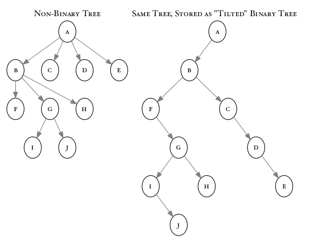

# NIU CSCI 340 Assignment 6
## Binary Trees - Storing XML Data

### Introduction

The purpose of this assignment is to have you perform a practical task using binary trees. This time, that task will be to implement a simplified XML parser.

### Your Task

You are responsible for implementing, all of the following functions:

 - For general binary tree functionality (in `bintree.h`
   - `inorder(root, fn)`
   - `preorder(root, fn)`
   - `postorder(root, fn)`
   - `levelorder(root, fn)`
   - `delete_tree(root)`

 - For dealing with "tilted" trees (in `bintree.h`):
   - `tilted_find_parent`
   - `tilted_get_children`
   - `tilted_levelorder`

 - For the XML parser (in `xml.cc`: 

   - `to_string(const xml_element &element, bool opening)`
   - `xml_handle_tag`
   - `xml_handle_plaintext`
   - `xml_handle_attributes`
   - `xml_add_node`
   - `xml_close_tag`
   - `xml_print_subtree`
   - `xml_find_by_name`
   - `xml_find_with_attr`

### What is XML?

XML, short for eXtensible Markup Language, is a tool for encoding heirarchically organized data into a text file. You'll be writing parts of a program that reads a file in a simplified version of XML and builds a tree representing the data inside.

#### Elements

XML is composed of "elements" and plain text. Elements are allowed contain other elements, and plain text. Plain text doesn't contain anything. The contents of an element should be represented as children of that element on a tree.

plain text
: Just normal, ASCII text, but you will need to avoid the characters `'<'` and `'>'`, as they will be used to identify "tags".

tags
: Tags are used to denote the beginning and end of an element. Everything between the opening tag and the closing tag for an element is said to be "contained" by that element.

opening tag
: This denotes the beginning of an element, i.e. `<tag>` indicates that an element named "tag" has begun. Any attributes associated with the element must be specified in this opening tag.

closing tag
: This denotes the end of an element, i.e. `</tag>` indicates that the most recent element named `tag` is now complete.

attributes of an element
: These are key/value pairs associated with an element. If there are any, they will be written in the opening tag. As an example `<tag height="100" width="200">` is an open tag with two attributes. The first one has a key of `height` with a value of `100`, and the second has a key of `width` and a value of `200`. Attributes are separated from the tag name and from other attributes by *whitespace*, and the values should always be in double quotes.

whitespace
: In the XML standard, whitespace is defined as spaces `' '`,  tab characters `'\t'`, newlines `'\n'`, and carriage returns `'\r'`. Leading and trailing whitespace will be trimmed. Attributes are separated by one or more characters of whitespace.

#### Well-formed XML

For our purposes, well-formed XML is XML data that follows these rules:

#. All XML elements must have a closing tag. 
#. XML tags are case-sensitive.
#. Attribute values must always be quoted.
#. All XML elements must be properly nested. This is a constraint on the ordering of closing tags where inner elements contained by an outer element must all be closed before the outer element can be closed.
  - `<a><b></b></a>` is properly nested because the inner tag is closed before the outer tag
  - `<a><b></a></b>` is *not* properly nested, because the outer `a` tag is told to close before the `b` tag.

Your assignment must work for well-formed XML. XML that is not well-formed will cause problems, and your program should generate error messages when these problems are encountered.

#### XML Features not Supported

There are several XML features that we will be avoiding for simplicity's sake, these include, but are not limited to:

- Open tags that are self closing, like `<tag/>` will not be supported.
- Entities such as `&lt;`, `&gt;`, `&amp;`, etc., will not be interpreted.
- Only attributes in the `key="value"` form will be handled, no turning on boolean attributes by naming them.
- `CDATA` will not be used.
- XML namespaces and DTD will not be used.

### "Tilted" Trees

XML documents don't lend themselves immediately to binary trees. An element is able to contain other elements, and this is not constrained to just two. However, there is a way of representing any non-binary tree in a form that fits into a binary tree.

To do this, we change the meaning of the left and right pointers in our binary tree node. We redefine the left child of a node to point to the node's first child on the non-binary tree, and we redefine the right child of the node to point to the node's next sibling. We'll call these "tilted" trees, because the binary tree resembles the other, but tilted by 45 degrees. Here is an example.

{width=50%}

You could tilt the tree in either direction, but we're using the left for children and right for siblings because it will work better with the traversals you've already learned. 

### Provided for You

I have provided parts of this assignment for you, and you will not need to reimplement those portions:

#### `enum xmltype { plain, tag };`

This is an enumeration type with two possibilities. It will be used in the `xml_element` class to indicate the type of the element:

- `plain` - plain text
- `tag` - tag-based element

#### `class xml_element`

This is the class you will use to store information on elements as you insert them into your tree. The nodes in your tree will use this as the `T` template parameter, so the `data` element for each node will be one.

- `type` - an `xml_type` that will be either `plaintext` for plain text, or `tag` for a tag element
- `name` - If the element is a tag, the name of the tag. If not, unused.
- `fulltext` - The full text of the element. This will be the text of a plain text element, or the tag specifier for a tag.
- `attrs` - a `map<string,string>` containing any attributes detected for a tag
- `closed` - a `bool`. Defaults to `false`. Will be set to `true` when the tag is closed.

#### `class xml_tree_state`

This is a class used to represent the current state of the tree as it is parsed.

- `root` - a pointer to the `root` of the tree. Will be `nullptr` for an empty tree.
- `cur`  - a pointer to the current node, used in the parsing algorithm when adding elements and closing tags.

#### `parse_xml( ist, state, verbose )`

I provided this function for you. It handles reading the data from the XML file, and it will call your functions to handle tags and plain text encountered.

#### `trim`

This is another function that is provided. It takes a string and returns a new string that contains the input string with its leading and trailing whitespace removed.

### Functions You Implement - Binary Tree

#### `inorder(root,fn)`, `preorder(root,fn)`, `postorder(root,fn)`, `levelorder(root,fn)`

- `root` - The root of the tree to traverse
- `fn` - A function or function-like object that is called to visit each node during the traversal. 

Each of these functions performs the traversal it is named after on the tree with `root` as its root, calling `fn` as it visits each node.

#### `delete_tree(root)`

- `root` - The root of the tree for which all nodes will be deleted.

Deletes all of the nodes in the tree with `root` as its root, freeing up any dynamically-allocated memory used.

### Functions You Implement - Tilted Trees:
#### `tilted_find_parent( node )`

- `node` - The node whose parent we would like to know.

This function returns a pointer to the node that is the *real* parent of the current node, on the non-binary tree represented by this tilted binary tree. If it has no parent, return `nullptr`.

#### `tilted_get_children( node )`

- `node` - The node whos children we would like to gather.

This function returns a `vector` containing pointers to all of the nodes that are *direct* children of `node` in the non-binary tree represented by this tilted binary tree. If `node` is `nullptr` or a leaf node, then return an empty `vector`.

#### `tilted_levelorder( root, fn )`

- `root` - the root of the tree to traverse
- `fn` - The function or function-like object to be called with the current node when visiting.

This function performs a level order traversal of the non-binary tree that was tilted to create the binary tree with root `root`. It will call `fn` to visit each node. This traversal is best done non-recursively. I recommend using a `queue`. Remember that each of your nodes can *actually* have multiple children instead of just the two that it would have if we were treating the binary tree normally.

### Functions You Implement - XML Parsing: 

#### `xml_handle_tag( tagstring, state, verbose )`

- `tagstring` - This string will contain the entirety of the text that detected as a tag. This will include the `'<'` at the beginning and the `'>'` at the end.
- `state` - an `xml_tree_state` containing the current state of the tree, this will be needed to add/close the node in the appropriate location.
- `verbose` - boolean value. If `true`, you may print out debug information in the function. If `false`, only print error messages.

This function is called by `parse_xml` whenever a tag has been found in the input.

In this function, you will need to find out the name of the tag, and whether it is an opening tag or closing tag.

If the string is empty, too short to be a valid tag, or does not begin with `'<'` and end with `'>'`, then the tag is invalid. Print an error message and return `1` immediately.

If it is an opening tag, it may have attributes. You must pass the portion of the `tagstring` after the name to the `xml_handle_attributes` function to break down those attributes and store them into the attribute map for the node.

Once you've broken down the tag into its parts, construct an `xml_element` and call `xml_add_node` to add it to the tree in the appropriate location.

If it's a closing tag (it has a `'/'` right after the `'<'` that begins the tag), call `xml_close_tag` to close the tag.

Returns the number of errors detected.

#### `xml_handle_attributes( input, attrs, verbose )`

- `input` - a `string` containing the remaining text after the name of an opening tag.
- `attrs` - This is a reference to the `map<string, string>` that will be used to store the attributes for the current element.
- `verbose` - boolean value. If `true`, you may print out debug information in the function. If `false`, only print error messages.

This function is responsible for detecting the `key="value"` attributes found in the string, `input`. Attributes are separated by one or more pieces of whitespace (as defined above), but there may be no spaces around the `'=`'.

Your function will treat everything between the quote immediately (no whitespace allowed) following the equal sign and the next quote it finds as the text of the string forming the attribute's value. The quotes will not be included in your string.

Thus, you would split the string «`    attr1="value1 "    attr2=" va lue2"  `» into two entries in the map, `attrs`.
```c
  attrs["attr1"] = "value1 ";
  attrs["attr2"] = " va lue2";
```

If you have an attribute without a value, or spaces around the equal sign, then the input is invalid, print an error.

If you reach the end of the string searching for the ending quote of an attribute's value, use what is there as a value, but print an error message about expecting the quote and not finding it.

Returns the number of attributes detected.

#### `xml_handle_plaintext( plaintext, state, verbose )`

- `plaintext` - The full text of the plain text detected.
- `state` - `xml_tree_state` used by `xml_add_node` when adding the new element to the tree.
- `verbose` - boolean value. If `true`, you may print out debug information in the function. If `false`, only print error messages.

This function is called by `parse_xml` whenever it detects plain text outside of a tag. It must construct a plaintext `xml_element` and call `xml_add_node` to place it on the tree in the appropriate location.

The function will return the number of errors encountered (which will likely have occurred in the call to `xml_add_node`).

#### `xml_add_node( element, state, verbose )`

- `element` - The `xml_element` to insert onto the tree.
- `state` - An `xml_tree_state` with the current state of the tree.
- `verbose` - boolean value. If `true`, you may print out debug information in the function. If `false`, only print error messages.

This function is responsible for inserting a new element onto a tree.

If there is currently nothing in the tree, the new element is inserted at the root.

If not, look at the current position within the tree, found in the `state` object.

- If the current node pointer is `nullptr`, then print out an error message and return `1`.
- If the current node is plain text or a *closed* tag, then the new element will be inserted as as sibling -- to its right.
- If the current node is an *open* tag, then the new node will be inserted as a child -- to its left.

After you insert the element, set the current position to the location of the newly inserted node.

Returns the number of errors encountered.

#### `xml_close_tag( name, state )`

- `name` - the name of the tag to close
- `state` - the `xml_tree_state` object that contains info on the XML tree

This function tries to close the most recently opened tag whose name matches the `name` string.

If the tag is closed immediately after opening, then it is possible to find the tag to close in the current location of the tree.

If it's not found in the current location, you should find the current node's *real* parent (remember our binary tree is a tilted non-binary tree). You can use the `tilted_find_parent` function to do this.

If the tag with the right name is found in one of those locations, mark it as closed and set the current location of the tree to the tag just closed. Return `0` for success.

If you do not find a tag with the right name in either of those places, then there is either something wrong with your tree (check your `xml_add_node` logic), or the XML was not properly nested. Print an error message and return 1.

Returns the number of errors encountered -- 0 for success.

#### `xml_find_by_name( root, name )`

- `root` - Pointer to the root of XML tree to search.
- `name` - The name of the tag to find.

This function does a preorder traversal of the XML tree with `root` as its root, building a `vector` containing pointers to all of the nodes containing elements whose name matches the given `name`.

Returns the `vector` built.

#### `xml_find_with_attr( root, attrname )`

- `root` - Pointer to the root of the XML tree to search.
- `attrname` - The name of the attribute to search for.

This function does a preorder traversal of the XML tree with `root` as its root, building a `vector` containing pointers to all of the nodes containing elements that have an attribute named `attrname`.

Returns the `vector` built.

#### `to_string( element, opening)`

- `element` - The `xml_element` we would like to generate a string for.
- `opening` - A `bool`. If `true`, print tags as opening tags. If `false`, print as a closing tag.

This function should return a string containing the XML representation of the element, `element`, passed in.

If that element is a tag, then `opening` controls whether the tag is printed as an opening tag (if `true`), with all of its attributes, or a closing tag (if `false`), with the `'/'` after the `'<'`. This should be constructed based on the `xml_element`'s `name` and the map `attrs`, and not the `fulltext` member.

Plain text elements just print their full text, the `fulltext` member is the right choice.

#### `xml_print_subtree( root, ost )`

- `root` - The root node of the tree to print out as XML.
- `ost` - The `ostream` to send the output to.

This function will print out the XML tree (or subtree) with `root` as its root as valid XML.

### Notes

Remember to continue with our routine of creating a `development` branch and making all changes to that branch, leaving `main` entirely alone. This will be necessary to submit the pull request at the end, signaling completion of your program to the graders.

Your work should be done in `bintree.h` and `xml.cc`. Do not alter the other files that were provided with the assignment. If you use work from a previous assignment, make sure that you do push the necessary files to the GitHub repo so that they will be there when the grader tries to compile.

You should feel free to create whatever files you want to test things locally, including writing your own simple programs to test small parts on their own, but none of them should end up becoming a part of your remote repo. I actually *encourage* you to write unit test programs for yourself, but they should not be a part of your submission.

**DO NOT ADD OR COMMIT THE EXECUTABLE FILES CREATED WHILE COMPILING.** They are big and we will be compiling anyway.

### Testing

There are a number of testing programs included. These will be used to evaluate the functionality of your implementations of the required functions. Typing `make` will attempt to compile them all, and will succeed to the degree it can with whatever you have implemented at that point.

The table below has a list of the tests available, and they are shown in order from least complex to most complex.

|Order|Test |Purpose  |
|:-:  |:----|:--------------------|
1|`test1` |Testing your work on a known tree.
2|`test2` |Test printing known XML elements.
3|`test3` |Test your `print_xml_tree` on a known tree.
4|`test4` |Use `parse_xml` and `print_xml_tree` the data read in.
5|`test5` |Test searching for tags and attributes on a tree from a file.

The expected output is contained in the `*.refout` files in the `output/` directory, and there will be several example XML files in the `input/` directory.

### How To Submit
 
Like the other assignments for this semester, we will be doing submissions through GitHub. Make sure you
do all of your development in the `development` branch. You can commit as many times as you need to, but keep in mind that this will grow the size of your repo and you may run up against the quota on turing/hopper if it gets too big.

When you are finished implementing everything required and the test program is working properly, make sure you add, commit, and push the working version to the repo. Once that is done, **SUBMIT** a pull request but **DO NOT ACCEPT IT**. 

### Grading Considerations

  - Does it compile? Does it run? All of the tests should compile and run on turing/hopper with the `Makefile` provided, and points will be deducted for each test that will not compile.
  - Does the output match for all of the tests? I have provided reference output for each of the test programs, so you can compare your program's output to what is expected. This output can be found in the files ending in `.refout`.
  - Did you change files you're not allowed to? There are warning messages at the top of several of the files telling you not to make changes. If you make changes to these, you will receive a grade penalty. You can write your own test programs if you'd like, but do not commit them or push them to the server, and make sure the only modifications that make it to GitHub are the required ones.
  - Did you commit/push all of the source code needed to compile your program?
  - Did you indent your code? 
    - Indentation aids in the readability of source code, and if you're not indenting your code blocks, the grader will legitimately dislike you for it. I'm authorizing them to mark you off if you subject them to reading that.
  - Did you document your code?
    - You need a docbox at the top of every one of the files you're required to change including:
      - Your name
      - Your zid
      - Your GitHub ID
      - Your course section
      - A description of what the program does
    - You should add a docbox for every function that you implement, explaining what it does and what each parameter is for.
    - Add other comments inside your code blocks describing what you're doing and why.
    - The use of `doxygen` style comments is encouraged, but not required.
